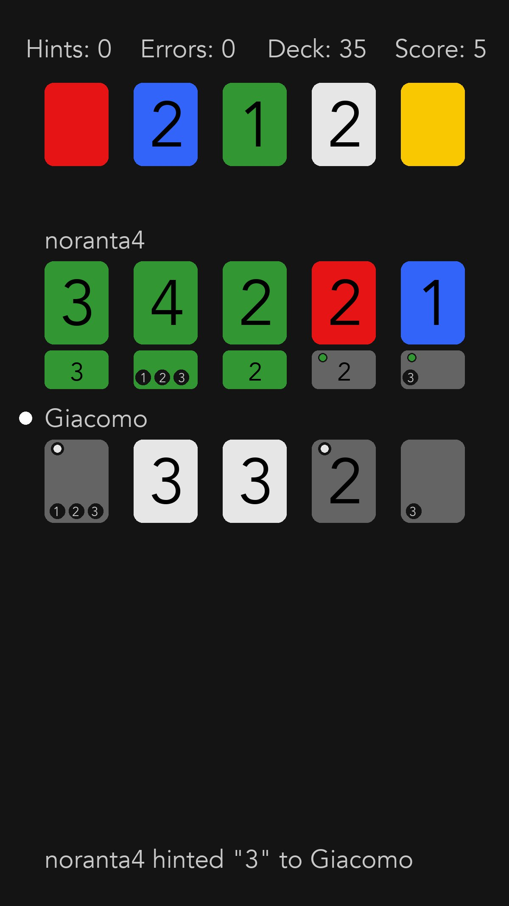

# Hanagram
Telegram bot to play Hanabi with your friends.



# Install
Install Hanagram and its dependencies:
```bash
poetry install
```

# Telegram game
How to play a Telegram game:
- Start the server with `python main.py <your-bot-token>`
- Send `/test <number-of-players>` in a private chat, to test.
- Add your bot to a group chat.
- Send `/new_game` in a group chat to create a new game.
- Players must first activate the bot with `/start` in private chat.
- Users can join the game with the `Join` button displayed.
- Send `/start_game` to start playing!

# Local game
How to play a local game. Let's say players are Alice, Bob and Casey.
- Run `python hanabi.py Alice Bob Casey`
- On each turn, type one of those actions:
    - `play <index of card to play>`
    - `discard <index of card to play>`
    - `hint <player name to hint> <color or value>`
