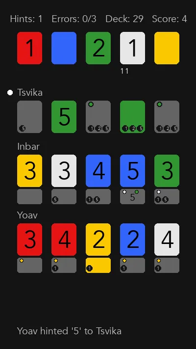

# Hanagram

Telegram bot to play Hanabi with your friends.



# Usage

- Get an API TOKEN from `@BotFather`
- Save to the `.env` file:

```bash
cp .env.sample .env
nano .env  # set the API TOKEN
```

And run the server with
[uv](https://docs.astral.sh/uv/getting-started/installation/)

```bash
uv run main.py
```

# Telegram game

How to play a Telegram game:

- Add the bot to a telegram group.
- All players should start a private chat with the bot. Send `/link_for_newbies`
  to help them do it.
- Send `/new_game` in a group chat to create a new game.
- Users can now join the game with the `Join` button displayed.
- When everyone joined, send `/deal_cards` to start playing!

Alternatively:

- Send `/test <number-of-players>` in a private chat.

# Local game

How to play a local game. Let's say players are Alice, Bob and Casey.

- Run `uv run play-repl Alice Bob Casey`
- On each turn, type one of those actions:
  - `play <index of card to play>`
  - `discard <index of card to play>`
  - `hint <player name to hint> <color or value>`

# Development

- please run `uv run pre-commit install` to set up the pre-commit hooks.
