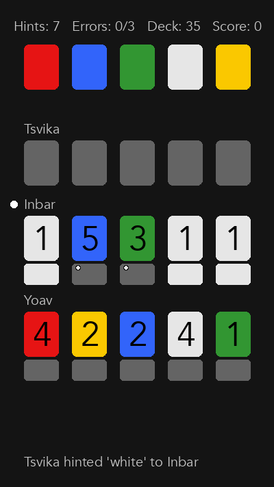

# Hanagram

[![Tests][tests-badge]][tests-link]
[![uv][uv-badge]][uv-link]
[![Ruff][ruff-badge]][ruff-link]
[![Black][black-badge]][black-link]
\
[![Made Using tsvikas/python-template][template-badge]][template-link]
[![GitHub Discussion][github-discussions-badge]][github-discussions-link]
[![PRs Welcome][prs-welcome-badge]][prs-welcome-link]

## Overview

Telegram bot to play Hanabi with your friends.



## Usage

- Get an API TOKEN from `@BotFather`
- Save to the `.env` file:

```bash
cp .env.sample .env
nano .env  # set the API TOKEN
```

And run the server with
[uv](https://docs.astral.sh/uv/getting-started/installation/)

```bash
uv run play-telegram
```

### Telegram game

How to play a Telegram game:

- Add the bot to a telegram group.
- All players should start a private chat with the bot. Send `/link_for_newbies`
  to help them do it.
- Send `/new_game` in a group chat to create a new game.
- Users can now join the game with the `Join` button displayed.
- When everyone joined, send `/deal_cards` to start playing!

Alternatively:

- Send `/test <number-of-players>` in a private chat.

### Local game

How to play a local game. Let's say players are Alice, Bob and Casey.

- Run `uv run play-repl Alice Bob Casey`
- On each turn, type one of those actions:
  - `play <index of card to play>`
  - `discard <index of card to play>`
  - `hint <player name to hint> <color or value>`

## Development

### Getting started

- install [git][install-git], [uv][install-uv].
- git clone this repo:
  `git clone https://github.com/tsvikas/hanagram.git`
  or `gh repo clone tsvikas/hanagram.git`
- run `uv run just prepare`

### Tests and code quality

- use `uv run just format` to format the code.
- use `uv run just lint` to see linting errors.
- use `uv run just test` to run tests.
- use `uv run just check` to run all the checks (format, lint, test, and pre-commit).
- Run a specific tool directly, with
  `uv run pytest`/`ruff`/`mypy`/`black`/`pre-commit`/...

<!--- Badges to add after adding RTD documentation
[![Documentation Status][rtd-badge]][rtd-link]

[rtd-badge]: https://readthedocs.org/projects/hanagram/badge/?version=latest
[rtd-link]: https://hanagram.readthedocs.io/en/latest/?badge=latest
-->

<!--- Badges to add after writing tests. Also follow the link to finish setup
[![codecov][codecov-badge]][codecov-link]

[codecov-badge]: https://codecov.io/gh/tsvikas/hanagram/graph/badge.svg
[codecov-link]: https://codecov.io/gh/tsvikas/hanagram
-->

<!--- Badges to add after uploading to PyPI
[![PyPI version][pypi-version-badge]][pypi-link]
[![PyPI platforms][pypi-platforms-badge]][pypi-link]
[![Total downloads][pepy-badge]][pepy-link]

[pepy-badge]: https://img.shields.io/pepy/dt/hanagram
[pepy-link]: https://pepy.tech/project/hanagram
[pypi-link]: https://pypi.org/project/hanagram/
[pypi-platforms-badge]: https://img.shields.io/pypi/pyversions/hanagram
[pypi-version-badge]: https://img.shields.io/pypi/v/hanagram
-->

[black-badge]: https://img.shields.io/badge/code%20style-black-000000.svg
[black-link]: https://github.com/psf/black
[github-discussions-badge]: https://img.shields.io/static/v1?label=Discussions&message=Ask&color=blue&logo=github
[github-discussions-link]: https://github.com/tsvikas/hanagram/discussions
[install-git]: https://git-scm.com/book/en/v2/Getting-Started-Installing-Git
[install-uv]: https://docs.astral.sh/uv/getting-started/installation/
[prs-welcome-badge]: https://img.shields.io/badge/PRs-welcome-brightgreen.svg
[prs-welcome-link]: http://makeapullrequest.com
[ruff-badge]: https://img.shields.io/endpoint?url=https://raw.githubusercontent.com/astral-sh/ruff/main/assets/badge/v2.json
[ruff-link]: https://github.com/astral-sh/ruff
[template-badge]: https://img.shields.io/badge/%F0%9F%9A%80_Made_Using-tsvikas%2Fpython--template-gold
[template-link]: https://github.com/tsvikas/python-template
[tests-badge]: https://github.com/tsvikas/hanagram/actions/workflows/ci.yml/badge.svg
[tests-link]: https://github.com/tsvikas/hanagram/actions/workflows/ci.yml
[uv-badge]: https://img.shields.io/endpoint?url=https://raw.githubusercontent.com/astral-sh/uv/main/assets/badge/v0.json
[uv-link]: https://github.com/astral-sh/uv
